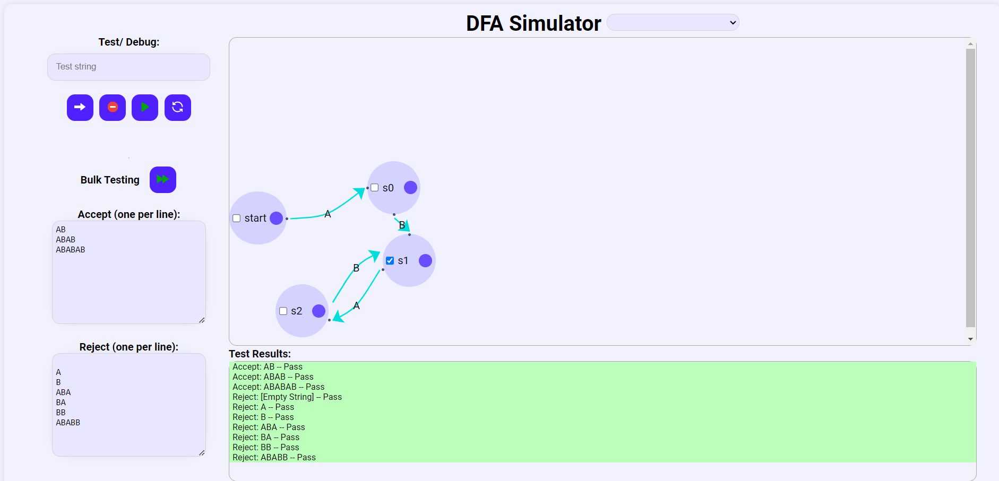

# DFA Simulator 🤖

Welcome to the DFA Simulator! This interactive web application allows you to simulate and visualize Deterministic Finite Automata (DFA) in a user-friendly environment. 🎯



## Live Demo 🌐

Explore the DFA Simulator in action: [https://dfa-simulator-ashy.vercel.app/](https://dfa-simulator-ashy.vercel.app/)

## Features ✨

- **Canvas Visualization**: The application features a central canvas area where you can create and manipulate DFA states through intuitive interactions. 🖼️
- **State Creation**: Double-click on the canvas to create new states for your DFA. 🆕
- **Transition Definition**: Connect states by drawing transitions between them and define the corresponding input values. ➡️
- **String Testing**: Test your DFA by providing input strings to see their acceptance or rejection. 🔍
- **Manual Debugging**: Step through the DFA manually, exploring state transitions with specific inputs for a deeper understanding. 🐞
- **Example DFAs**: Access pre-defined examples to learn and experiment with different DFA configurations. 📚
- **Intuitive Interface**: The user-friendly interface makes it easy to navigate and interact with the DFA Simulator. 🖥️

## Getting Started 🚀

To run the DFA Simulator locally, follow these steps:

1. Clone the repository:
    ```bash
    git clone https://github.com/your-username/dfa-simulator.git
    ```
2. Open the `index.html` file in your preferred web browser.
3. Start creating and simulating your DFAs! 🎉

## Technologies Used 🛠️

- **HTML5** 📄
- **CSS3** 🎨
- **JavaScript** 🔗

## Contributing 🤝

Contributions to the DFA Simulator project are welcome! If you have any ideas, bug fixes, or improvements, feel free to open an issue or submit a pull request.

## License 📄

This project is licensed under the MIT License.
